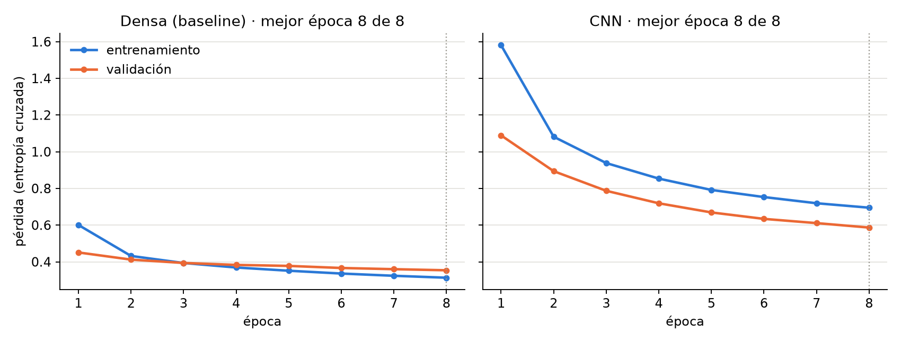
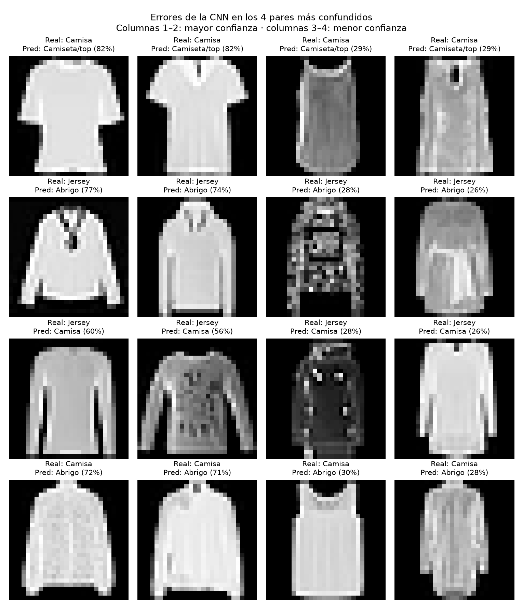

# U02.LAB07 · Análisis de la CNN con Fashion-MNIST

Ejecución: `uv run python scripts/train_cv.py --epochs 8` (CPU AMD Ryzen 5 5600X, TensorFlow
2.21.0, semilla 42). Partición: 54.000 imágenes de entrenamiento, 6.000 de validación (las
últimas del conjunto de entrenamiento) y 10.000 de prueba; detalle en `data_summary.json`.

## Paso 4 · Interpretación de entrenamiento y validación

Evidencia: `learning_curves.png`, `training_history.json`, `cv_metrics.json` y
`per_class_metrics.csv`.

| Modelo | Pérdida entrenamiento (época 1 → 8) | Pérdida validación (época 1 → 8) | Mejora de validación en la época 8 | Mejor época | Accuracy prueba | F1 macro prueba |
|---|---|---|---|---|---|---|
| Densa (baseline) | 0,601 → 0,313 | 0,451 → 0,354 | −0,006 | 8 de 8 | 0,866 | 0,865 |
| CNN | 1,581 → 0,695 | 1,089 → 0,587 | −0,024 | 8 de 8 | 0,793 | 0,789 |

### Lectura según los patrones del manual

**Ambas pérdidas disminuyen → los dos modelos aprenden patrones útiles.** En los dos casos la
pérdida de validación baja en todas las épocas, sin excepción.

**Entrenamiento baja y validación sube → no se observa sobreajuste.** En ningún modelo la
validación empeora. El `EarlyStopping` (paciencia 2) nunca se activó: la mejor época es la
última en ambos casos.

**Ambas pérdidas permanecen altas → la CNN está subentrenada.** Su pérdida de validación
final (0,587) es 1,7 veces la de la red densa (0,354) y todavía mejoraba 0,024 en la última
época. El límite de 8 épocas cortó el aprendizaje antes de que convergiera. La red densa,
en cambio, mejora solo 0,006 en la última época: está cerca de su techo. Por eso la CNN
rinde peor (F1 0,789 frente a 0,865) sin que eso demuestre que la arquitectura sea inferior:
con este presupuesto de épocas no alcanza su capacidad.

En la CNN la pérdida de validación queda por debajo de la de entrenamiento. No indica un
error: el `Dropout(0.25)` solo actúa durante el entrenamiento y penaliza esa pérdida, y la
pérdida de entrenamiento es un promedio a lo largo de cada época, mientras el modelo
todavía mejora.

**Accuracy alta pero una clase con recall bajo → el promedio oculta la debilidad en Camisa.**

| Clase | Recall densa | Recall CNN |
|---|---|---|
| **Camisa** | **0,597** | **0,374** |
| Jersey | 0,684 | 0,642 |
| Abrigo | 0,870 | 0,663 |
| Camiseta/top | 0,848 | 0,807 |
| Vestido | 0,903 | 0,843 |
| Sandalia | 0,962 | 0,885 |
| Botín | 0,937 | 0,896 |
| Bolso | 0,953 | 0,937 |
| Zapatilla | 0,940 | 0,952 |
| Pantalón | 0,969 | 0,932 |

El patrón aparece en los dos modelos. La red densa tiene una accuracy del 86,6 %, pero solo
recupera el 59,7 % de las camisas; en la CNN la brecha es mayor (79,3 % frente a 37,4 %).
Las clases débiles son siempre prendas superiores (Camisa, Jersey, Abrigo, Camiseta/top),
que comparten silueta en imágenes de 28×28 en escala de grises. Calzado, bolsos y
pantalones superan el 88 % de recall en ambos modelos. La matriz de confusión y los
ejemplos de error se analizan en los pasos siguientes.

### Implicación

El resultado no permite concluir que una red densa sea mejor que una CNN para este
problema: compara una red densa casi convergida con una CNN interrumpida a mitad de su
aprendizaje. Una comparación justa exige entrenar ambas hasta que el `EarlyStopping` se
active, registrando el costo adicional de tiempo y energía.

## Paso 5 · Comparación entre baseline y CNN

Evidencia: `cv_metrics.json`, `per_class_metrics.csv`, `runtime.json` y los modelos
`models/dense.keras` y `models/cnn.keras`.

**Hardware** (`runtime.json`): CPU AMD Ryzen 5 5600X (6 núcleos, 12 hilos), Windows 11,
Python 3.12.14, TensorFlow 2.21.0, ejecución en CPU. La GPU del equipo (AMD Radeon RX 6800
XT) no se usó: TensorFlow no admite GPU en Windows nativo y la ruta GPU del proyecto
requiere NVIDIA.

| Criterio | Densa (baseline) | CNN | CNN frente a densa |
|---|---|---|---|
| F1 macro (prueba) | **0,865** | 0,789 | **−0,075** |
| Accuracy (prueba) | **0,866** | 0,793 | −0,073 |
| Parámetros entrenables | 50.890 | **19.466** | −62 % |
| Archivo del modelo (sin optimizador) | 215,5 KB | **102,9 KB** | −52 % |
| Tiempo de entrenamiento (8 épocas) | **5,8 s** | 54,1 s | ×9,4 |
| Inferencia, mediana de 5 repeticiones | **0,031 ms/imagen** | 0,072 ms/imagen | ×2,3 |
| Rango de las 5 repeticiones | 0,0301–0,0312 | 0,0649–0,0801 | — |

*Tiempos de la ejecución registrada en `cv_metrics.json`. Los tiempos cambian ligeramente
en cada ejecución; las métricas de desempeño no (semilla fija).*

### Cómo se midió

- **Misma partición:** los dos modelos se entrenan, validan y evalúan con exactamente las
  mismas imágenes (54.000 / 6.000 / 10.000).
- **Tamaño del archivo:** ambos modelos se guardan de la misma forma, solo con arquitectura
  y pesos. Sin esta precaución, Keras incluye el estado del optimizador Adam, que triplica
  el tamaño (`best_cnn.keras` pesa 262 KB frente a los 103 KB de `cnn.keras`) y no se usa al
  predecir.
- **Inferencia:** sobre el mismo lote de 10.000 imágenes de prueba. Primero se hace una
  predicción de calentamiento que se descarta (la primera llamada incluye la preparación
  interna de TensorFlow) y después 5 repeticiones; se informa la mediana, que no se ve
  afectada por una repetición atípica. En la ejecución registrada la densa varió poco
  respecto a su mediana (−2,7 % a +0,9 %), pero la CNN varió bastante más (−10,4 % a
  +10,6 %): los tiempos dependen de la carga del equipo en ese momento. En las ejecuciones
  realizadas, la mediana de la CNN osciló entre 0,054 y 0,072 ms por imagen y la proporción
  entre modelos entre ×1,8 y ×2,3. La conclusión (la CNN es unas 2 veces más lenta) se
  mantiene en todas.
- **Entrenamiento:** en varias ejecuciones sucesivas del script el tiempo osciló entre 5,0
  y 6,0 s (densa) y entre 48,0 y 54,1 s (CNN). La proporción se mantiene entre ×8 y ×10.

### Métricas por clase

La red densa supera a la CNN en recall en 9 de las 10 clases; la única excepción es Zapatilla (recall
0,952 frente a 0,940). Las mayores diferencias están en Camisa (recall 0,597 frente a
0,374) y Abrigo (0,870 frente a 0,663). Detalle completo en `per_class_metrics.csv`.

Las matrices de los dos modelos (`confusion_dense.png` y `confusion_cnn.png`) muestran el
mismo patrón: los errores se concentran entre prendas superiores. En la red densa las
mayores confusiones son Jersey → Abrigo (189), Camisa → Camiseta/top (170) y Camisa →
Abrigo (111); en la CNN, Camisa → Camiseta/top (274), Jersey → Abrigo (155) y Jersey →
Camisa (143).

### ¿La mejora predictiva justifica el costo adicional?

**No, porque no hay mejora: la CNN es peor y además más costosa.**

- **Desempeño:** pierde 0,075 de F1 macro y 7,3 puntos de accuracy.
- **Costo:** necesita unas 9 veces más tiempo de entrenamiento y unas 2 veces más tiempo
  por predicción en el mismo hardware.
- **Ventaja:** tiene 62 % menos parámetros y un archivo un 52 % más pequeño. Pero menos
  parámetros no implica menos cómputo: cada filtro convolucional se aplica en todas las
  posiciones de la imagen, mientras que cada peso de la red densa se usa una sola vez por
  imagen. Contando multiplicaciones-acumulaciones por imagen, la CNN realiza unas 3,84
  millones (casi todas en la segunda convolución: 14 × 14 posiciones × 64 filtros × 288
  entradas) frente a unas 51.000 de la red densa, unas 76 veces más. Por eso la CNN, siendo
  más pequeña, es más lenta.

**Decisión con esta evidencia:** se mantiene la red densa. Con 8 épocas la CNN no aporta
ninguna mejora marginal que compense su costo de entrenamiento e inferencia.

**Límite de la conclusión:** el paso 4 mostró que la CNN está subentrenada (su pérdida de
validación todavía bajaba en la última época). La comparación es válida para el presupuesto
de 8 épocas, no para la capacidad de cada arquitectura. Entrenar la CNN hasta que converja
podría invertir el resultado, pero aumentaría todavía más su costo; habría que repetir esta
tabla para decidir si esa mejora, de existir, compensa el tiempo y la energía adicionales.

## Paso 6 · Examen visual de los errores

Evidencia: `cnn_errors.png` y `cnn_error_examples.csv` (índice de la imagen de prueba, clase
real, predicción, confianza y probabilidad que el modelo asignó a la clase real).

**Selección de los casos.** En lugar de mostrar los primeros errores en orden, la figura toma
los **4 pares más confundidos** según la matriz de confusión de la CNN y, para cada par, los
2 errores con **mayor** confianza y los 2 con **menor** confianza. Así se ven tanto los
errores "seguros" como los dudosos de las confusiones que más pesan.

| Fila | Par (real → predicho) | Errores en prueba | Confianza de los casos (mayor / menor) |
|---|---|---|---|
| 1 | Camisa → Camiseta/top | 274 | 82 %, 82 % / 29 %, 29 % |
| 2 | Jersey → Abrigo | 155 | 77 %, 74 % / 28 %, 26 % |
| 3 | Jersey → Camisa | 143 | 60 %, 56 % / 28 %, 26 % |
| 4 | Camisa → Abrigo | 130 | 72 %, 71 % / 30 %, 28 % |

Los cuatro pares involucran solo prendas superiores. Ningún error frecuente mezcla calzado,
bolsos o pantalones con ropa superior.

### Lectura caso por caso

**Camisa → Camiseta/top (fila 1).** Los dos errores más seguros (82 %) son camisas de manga
corta con silueta de camiseta: hombros rectos y cuerpo recto. En uno se distingue una tira
oscura central (cuello o abotonadura), el único rasgo propio de una camisa, y ocupa apenas
uno o dos píxeles de ancho. Los dos casos de menor confianza (29 %) son prendas sin mangas,
de tirantes, que visualmente se parecen más a un top que a una camisa.

**Jersey → Abrigo (fila 2).** Los errores seguros son prendas de manga larga con cuello en V
o con solapa, donde el escote se confunde con la abertura de un abrigo. Los casos dudosos
tienen estampados o texturas fuertes que rompen la silueta, y el modelo no se compromete con
ninguna clase.

**Jersey → Camisa (fila 3).** Prendas de manga larga y silueta recta, casi todas lisas. Sin botones
visibles, la diferencia entre un jersey y una camisa de manga larga depende del tejido, y el
tejido no se distingue en 28×28 píxeles en escala de grises. Incluso los errores "seguros"
tienen confianza moderada (56–60 %).

**Camisa → Abrigo (fila 4).** Los errores seguros son camisas claras de manga larga y cuerpo
amplio, con la misma silueta que un abrigo. Uno de los casos dudosos es otra prenda sin
mangas etiquetada como camisa.

### Pares semejantes y ejemplos ambiguos

- **Pares visualmente semejantes:** las cuatro confusiones comparten silueta (torso, mangas,
  cuello). Lo que distingue estas clases en la realidad —tejido, botones, cierres, grosor—
  ocupa uno o dos píxeles o se pierde al reducir la imagen a 28×28 en escala de grises.
- **Errores con alta confianza (71–82 % en tres de los cuatro pares; 56–60 % en Jersey →
  Camisa):** el modelo apenas duda. Son el tipo de error más riesgoso, porque un usuario no
  tendría ninguna señal de alerta.
- **Ejemplos ambiguos:** en los casos de menor confianza, la clase predicha recibe entre
  26 % y 30 %, y la clase real a veces casi lo mismo. En la imagen 2986 (fila 4, columna 3)
  el modelo da 30 % a Abrigo y 28 % a Camisa: es prácticamente un empate.
- **Etiquetas discutibles:** varias prendas sin mangas o de tirantes están etiquetadas como
  "Camisa" (filas 1 y 4). Una persona probablemente las llamaría top. Parte del error medido
  en esta clase puede venir del etiquetado del dataset, no solo del modelo.

### Interpretación responsable

Fashion-MNIST es un **benchmark didáctico**: imágenes de 28×28 en escala de grises, con una
sola prenda centrada sobre fondo negro, sin oclusiones, sin variaciones de iluminación y con
10 clases fijas. Por eso:

- Un buen resultado aquí **no demuestra** que el modelo esté preparado para imágenes
  médicas, OCR, vigilancia ni ningún otro dominio, ni siquiera para fotografías reales de
  ropa (con color, fondos, personas o varias prendas en la misma imagen).
- Los errores observados son propios de la **resolución y del formato** del dataset. En
  imágenes reales aparecerían otros errores que este análisis no puede anticipar.
- Las métricas valen solo para la partición de prueba de Fashion-MNIST y para este
  presupuesto de 8 épocas.
